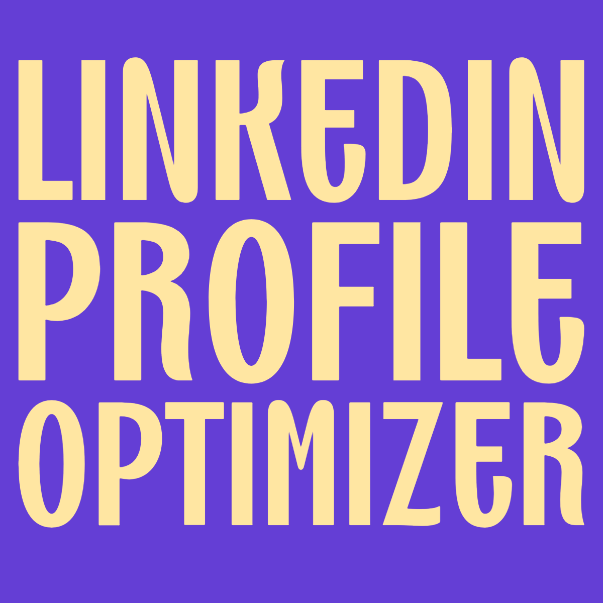
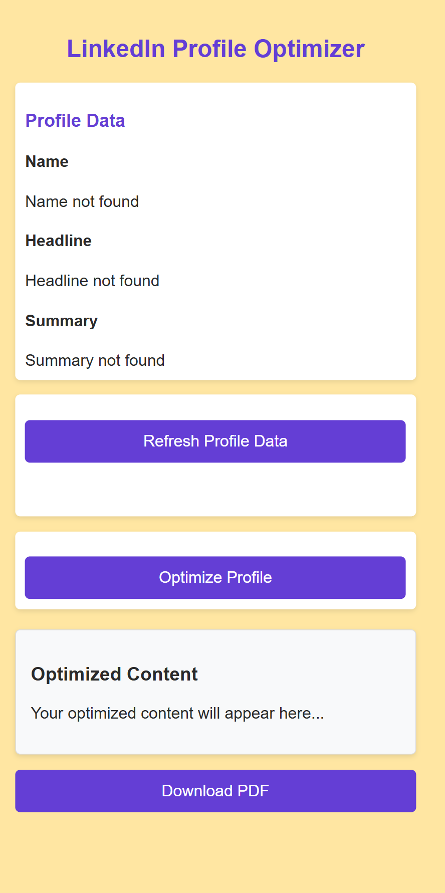
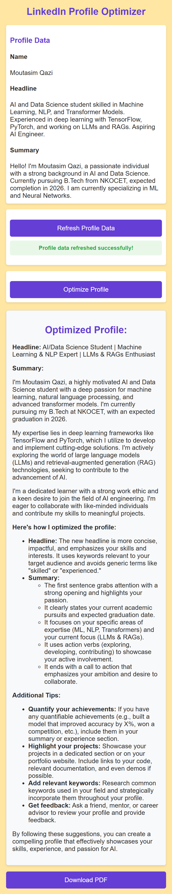

# LinkedIn Profile Optimizer Chrome Extension



This Chrome extension allows you to easily optimize and download your LinkedIn profile by leveraging the **Google Gemini API** (powered by Google Brain), a state-of-the-art **Large Language Model (LLM)**. The extension fetches your LinkedIn profile data, generates optimized content using the LLM, and allows you to download the optimized profile as a PDF.

## Features

- **Fetch Profile Data**: The extension retrieves your LinkedIn profile details, including name, headline, and summary, directly from the LinkedIn page.
- **Optimize Profile**: Utilizes the **Google Gemini API** (LLM) to suggest optimizations for your LinkedIn profile content, making it more impactful and professional.
- **Download PDF**: After profile optimization, you can easily download the updated profile content as a PDF.
- **Refresh Profile**: Refresh your profile data to fetch the latest details from LinkedIn.

## Screenshots

Here are some screenshots showing the LinkedIn Profile Optimizer extension in action:



*Figure 1: Extension Popup displaying the LinkedIn profile data.*



*Figure 2: Optimized profile content displayed within the extension.*

## Installation

1. Clone or download the repository:
   ```bash
   git clone https://github.com/MoutasimQazi/linkedin-profile-optimizer


2. Open Chrome and go to the Extensions page (`chrome://extensions/`).

3. Enable **Developer Mode** in the top right corner.

4. Click **Load unpacked** and select the folder containing the extension files.

5. Once the extension is installed, you will see the extension icon in the toolbar.

6. **Important**: Before running the extension, make sure to input your **Google Gemini API Key** in the code to enable the extension's functionality.

## How to Use

1. **Open the Extension Popup**  
   Click on the extension icon in your Chrome toolbar to open the popup.

2. **View or Refresh Profile Data**  
   The extension will display your LinkedIn profile data (name, headline, summary). If the profile data is missing or outdated, you can click the Refresh button to fetch the latest information from LinkedIn.

3. **Optimize Profile**  
   Click the Optimize button to send your profile data to the Google Gemini API for optimization. The AI-powered LLM will generate an optimized version of your profile content.

4. **Download PDF**  
   Once your profile has been optimized, you can download the content as a PDF by clicking the Download PDF button. The extension will generate a PDF of your profile with the optimized content.

5. **View Optimized Content**  
   Your optimized LinkedIn profile will appear within the popup interface. You can further tweak or adjust the content directly before downloading it.

## JS Modules Used

This extension uses the following JavaScript modules:

- **Google Generative AI (Gemini API)**: A cutting-edge Large Language Model (LLM) developed by Google Brain. It powers the optimization of the LinkedIn profile by generating impactful suggestions for improving the profile content. The Gemini API is responsible for understanding the context of your LinkedIn profile and generating enhanced text that resonates more effectively with viewers.
  
- **jsPDF**: A JavaScript library that enables the generation of PDF files. It is used to convert the optimized LinkedIn profile content into a downloadable PDF format.

- **Marked**: A markdown parser that converts markdown text into HTML. This is used to display the optimized profile content in a user-friendly format before downloading it as a PDF.

## Technologies Used

- **Google Gemini API (LLM)**: Used to generate optimized content for the LinkedIn profile, improving the profile's effectiveness and presentation.
- **jsPDF**: Used to generate downloadable PDFs of the optimized profile content.
- **Marked**: Converts markdown content to HTML for better presentation in the popup.

## Limitations

- **LinkedIn Profile**: The extension relies on the profile data being available. Ensure you're on a LinkedIn profile page for the extension to work correctly.
- **API Key**: The extension requires an API key for the Google Gemini API. Make sure you replace the placeholder API key in the code with your own valid key.

## Contributing

Feel free to fork the repository, make changes, and submit pull requests. Contributions are welcome!

## License

This project is licensed under the MIT License - see the LICENSE file for details.
